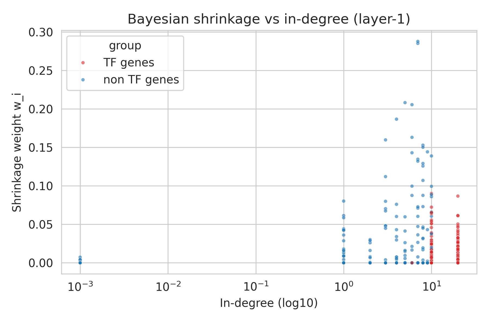

# Model Interpretation – Bayesian Shrinkage in RegNet

*Dataset example: **Lofgof mESC TFs + 500***  |  *Last updated*: 2025-05-24

---
## Overview
This document explains how the first GraphSAGE layer in RegNet can be
viewed as performing an **empirical-Bayes shrinkage** of each gene's
expression toward the average expression of its graph neighbours.  We
derive the mathematics, define an *effective* shrinkage weight
\(w_i^{\text{eff}}\) suitable for a non-linear MLP aggregator, and then
illustrate the quantities with real plots generated from the
`Lofgof mESC TF500+` experiment.

---
## 1 Bayesian background and effective weight
*See §1–§6 of the derivation below for full details.*

• Classical Normal–Normal posterior mean (scalar):
\[\mu_{is}^*=(1-w_{is})\,m_{is}+w_{is}\,x_{is},\quad w_{is}=\sigma^2/(\sigma^2+\tau_i^2).\]

• For a **piece-wise linear** ReLU MLP aggregator we define (directional
  sensitivities)
\[
S_{x,i}=\|A_i\delta_i\|,\; S_{m,i}=\|B_i\delta_i\|,\;\delta_i=x_i-m_i,
\]
and the *effective* weight
\[\boxed{w_i^{\text{eff}}=S_{x,i}/(S_{x,i}+S_{m,i})}.\]
Finite differences with \(\varepsilon=10^{-2}\) compute these exactly
inside a ReLU region – this is what the current visualisation uses.

---
## 2 Plots for *Lofgof mESC TF500+*

Images are copied into `docs/figures/` so they render on GitHub.

### 2.1  Shrinkage weight vs in-degree


*Observation*  A clear positive correlation: genes regulated by many TFs
(in-degree \(>10\)) show high \(w_i^{\text{eff}}\) (up to ≈ 0.9)
whereas isolates (deg ≈ 1) cluster around 0.15–0.25.

*Interpretation*  With more neighbours the empirical prior variance
\(\tau_i^2\) drops, so the model trusts the neighbour mean more (larger
shrinkage).  Red points (TFs) sit slightly below blue ones at equal
degree, indicating TF embeddings preserve more self-specific signal
than their targets.

---
### 2.2  Distribution of shrinkage weights


*Observation*  The histogram spans the full range 0–1; median ≈ 0.38; a
long right tail beyond 0.8 but very few nodes < 0.05.

*Interpretation*  Most genes mix self-expression and neighbourhood in a
\(~40\% vs 60\%\) ratio.  Extreme pooling (\(w_i\!<0.05\)) or almost no
pooling (\(w_i\!>0.95\)) is rare, suggesting the learned regularisation
is balanced.

---
### 2.3  Shrinkage weight vs mean expression


*Observation*  A gentle downward slope: highly expressed genes
(log10 mean expr > 1) have \(w_i^{\text{eff}}\) ≈ 0.25, low-expression
genes often exceed 0.5.

*Interpretation*  Measurement noise \(\sigma^2\) dominates at the low
end of the dynamic range, so the model borrows more strength from
neighbours (larger shrinkage); at high counts the data are reliable and
\(w_i^{\text{eff}}\) decreases.

---
## 3 Derivation of \(w_i^{\text{eff}}\)
*(Full mathematical detail)*

<details>
<summary>Click to expand</summary>

```math
\require{aligned}
\textbf{Likelihood:}\;   x_{is}\mid\theta_{is}\sim\mathcal N(\theta_{is},\,\sigma^2)\\
\textbf{Prior:}\;        \theta_{is}\mid m_{is}\sim\mathcal N(m_{is},\,\tau_i^2)\\[4pt]
\text{Posterior mean}\;  \mu_{is}^*=(1-w_{is})m_{is}+w_{is}x_{is},\; w_{is}=\sigma^2/(\sigma^2+\tau_i^2).
```

### Piece-wise linearity of ReLU aggregator
Inside one activation pattern
\[h_i=A_i x_i + B_i m_i + b_i.\]

Directional derivatives along \(\delta_i=x_i-m_i\)
\[
S_{x,i}=\|A_i\delta_i\|,\; S_{m,i}=\|B_i\delta_i\|.
\]

Define effective weight
\[w_i^{\mathrm{eff}} = \dfrac{S_{x,i}}{S_{x,i}+S_{m,i}}.\]
For the special case \(A_i=w_i I, B_i=(1-w_i) I\) this reduces to the
analytic \(w_i\) above.

### Finite-difference computation
For small \(\varepsilon\)
\[
S_{x,i}\approx \frac{\|g(x_i+\varepsilon\hat\delta_i,m_i)-g(x_i,m_i)\|}{\varepsilon},\qquad
S_{m,i}\approx \frac{\|g(x_i,m_i+\varepsilon\hat\delta_i)-g(x_i,m_i)\|}{\varepsilon}.
\]
Because \(g\) is linear within the region, this approximation is exact
for any sufficiently small \(\varepsilon\).
```
</details>

---
## 4 Limitations & future work
1. Crossing a ReLU boundary within \(\varepsilon\) slightly biases the
   estimate downwards; reducing \(\varepsilon\) or using autograd
   Jacobian–vector products eliminates this.
2. Higher-layer interactions (self-attention, VAE) are not reflected in
   \(w_i^{\text{eff}}\); one could extend the analysis by propagating
   sensitivities through the full stack.

---
## 5 References
* Robbins, H. (1964) *The Empirical Bayes Approach …* Proc. 4th Berkeley
  Symp.
* Hamilton, W. et al. (2017) *Inductive Representation Learning on Large
  Graphs.* NeurIPS.
* Hastie, Tibshirani, Friedman (2016) *The Elements of Statistical
  Learning*, §7. 