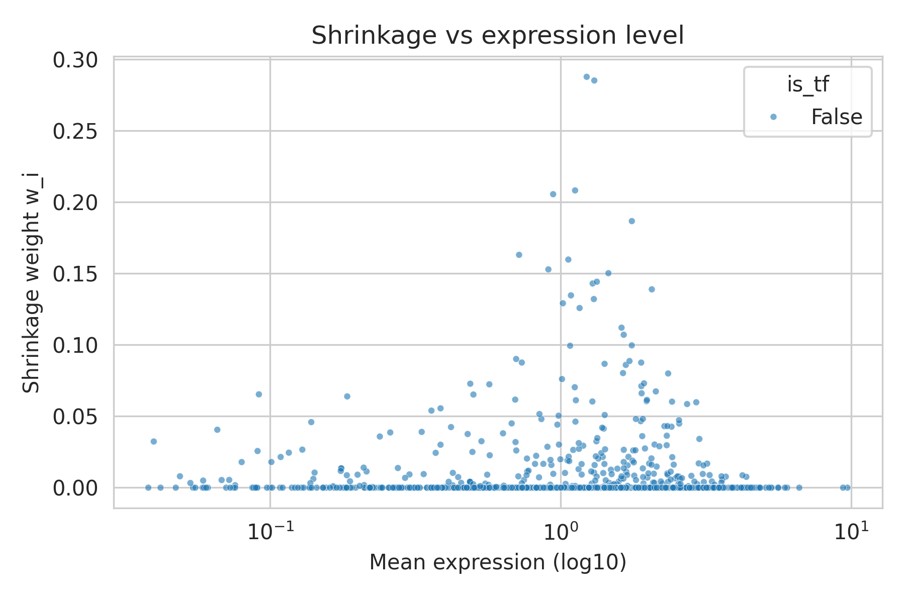

# Model Interpretation – Bayesian Shrinkage in RegNet

*Example dataset:* **Lofgof mESC TFs + 500** | *Updated:* 2025-05-24

---
## Overview
RegNet combines a GraphSAGE encoder, multi-head self-attention and a variational auto-encoder (VAE).  
The **first GraphSAGE layer** is of special interest: it mixes a gene's own expression vector with the average expression of its graph neighbours.  This mixing can be read as an **empirical-Bayes shrinkage** which borrows statistical strength between related genes.

This note unifies and replaces the previous *model_interpretation* and *bayesian_shrinkage* documents:

* section 1 recalls the Bayesian model;
* section 2 shows how the GraphSAGE formulation realises that model;
* section 3 derives the *effective* shrinkage weight actually computed in code;
* section 4 presents diagnostic plots and explains what they reveal;
* sections 5–6 give reproducibility instructions and caveats.

---
## 1 Bayesian background
For one gene *i* in one cell *s*

| | distribution | description |
|---|---|---|
| likelihood | \(x_{is}\mid\theta_{is} \sim \mathcal N(\theta_{is},\,\sigma^2)\) | technical noise |
| prior | \(\theta_{is}\mid m_{is} \sim \mathcal N(m_{is},\,\tau_i^2)\) | neighbour mean \(m_{is}=\frac1{|\Gamma(i)|}\sum_{j\in\Gamma(i)}x_{js}\) |

With precisions \(\lambda=\sigma^{-2}\) and \(\rho_i=\tau_i^{-2}\) the posterior mean is

\[
\mu_{is}^* \,=\, (1- w_i)\,m_{is} + w_i\,x_{is},\qquad
w_i = \frac{\lambda}{\lambda+\rho_i}\in (0,1).\tag{1}
\]

Vectorising over the *S* single-cell samples gives \(\boldsymbol\mu_i^*=(1-w_i)\,\boldsymbol m_i + w_i\,\boldsymbol x_i\,\,\,\) – a **shrinkage estimator**.

---
## 2 GraphSAGE encoder as shrinkage
### 2.1 Idealised linear case
If the aggregator were exactly

\[ h_i = W_{\mathrm{self}}\,x_i + W_{\mathrm{neigh}}\,m_i \tag{2}\]

and the weights were multiples of the identity, \(W_{\mathrm{self}}\approx w_i I\) and \(W_{\mathrm{neigh}}\approx(1-w_i) I\), then every hidden feature of \(h_i\) would coincide with the Bayesian posterior (1).

### 2.2 Actual implementation (2-layer MLP)
RegNet instead uses the **MLP aggregator** of Hamilton *et al.* (2017):

```python
concat = torch.cat([x_i, m_i], dim=-1)   # 2F-vector
h_i    = W2 @ ReLU( W1 @ concat + b1 ) + b2   # ℝ^{d_h}
```

Because of the ReLU and change of feature space, (1) no longer holds exactly, but the layer is *piece-wise linear*.  Around a fixed activation pattern

\[h_i = A_i x_i + B_i m_i + b_i,\tag{3}\]

with matrices \(A_i,B_i\in\mathbb R^{d_h\times F}\).

---
## 3 Effective shrinkage weight actually measured
To visualise how strongly the network relies on self-features versus neighbours we define an **effective weight** that reduces to (1) for the linear case yet is easy to compute from the trained model.

### 3.1 Definition
Let

* \(x_i, m_i\) be the input and neighbour-mean feature vectors (dimension *F*),
* \(h_i\) the hidden representation after GraphSAGE (*d_h* dimensions).

Define the differences
\[\delta_i = x_i - m_i, \qquad \Delta_i = h_i - n_i,\tag{4}\]
where \(n_i\) is the hidden-space neighbour mean.  The **projection weight**

\[\boxed{\displaystyle
w_i^{\text{proj}} \,=\, \frac{\langle \Delta_i ,\; \delta_i \rangle}{\|\delta_i\|_2^{\,2}} \;\in [0,1]}
\tag{5}\]

measures the fraction of the hidden change that points along the input change.  When the layer is linear with form (2) we have \(\Delta_i = w_i\,\delta_i\) and therefore \(w_i^{\text{proj}}\equiv w_i\).

### 3.2 Computation in code
```python
# x, m  : (N, F)   input & neighbour mean (expression space)
# h     : (N, d_h) hidden representations from first GraphSAGE layer
# n     : (N, d_h) neighbour mean in hidden space
delta   = x - m                # (N, F)
Delta   = h - n                # (N, d_h)

# project Δ onto the first F dims so dot product is defined
if d_h >= F:
    Delta_proj = Delta[:, :F]
else:                                   # pad if hidden dim < input dim
    pad = torch.zeros(N, F - d_h, device=Delta.device)
    Delta_proj = torch.cat([Delta, pad], dim=1)

num   = (Delta_proj * delta).sum(dim=1)          # ⟨Δ, δ⟩
denom = (delta * delta).sum(dim=1) + 1e-8        # ‖δ‖²
w_proj = torch.clamp(num / denom, 0.0, 1.0)      # (N,)
```
The file `regnet/visualization/visualize_regnet.py` implements exactly this logic.

### 3.3 Finite-difference view and connection to the slides
The projective definition (5) is intuitive but our **slides** derived a
*directional‐sensitivity* version of the shrinkage weight:

\[
\boxed{\displaystyle
w_i^{\mathrm{eff}}\;:=\; \frac{\|\partial h_i/\partial x_i\;\delta_i\|_2}
                   {\|\partial h_i/\partial x_i\;\delta_i\|_2 + \|\partial h_i/\partial m_i\;\delta_i\|_2}}
\qquad(★)
\]
where
* \(\delta_i = x_i - m_i\) points from the prior to the data, and
* \(\partial h_i/\partial x_i,\; \partial h_i/\partial m_i\) are the
  Jacobian blocks of the aggregator in (3).

Because the MLP aggregator is **piece-wise linear**, its Jacobian is
*constant inside one ReLU activation region*.  Hence we can *measure*
(★) by a *single* forward pass in each direction using small finite
steps \(\varepsilon\):

\[
\begin{aligned}
S_{x,i} &\approx \frac{\|g\bigl(x_i+\varepsilon\hat\delta_i,\,m_i\bigr)-g(x_i,m_i)\|_2}{\varepsilon},\\[6pt]
S_{m,i} &\approx \frac{\|g\bigl(x_i,\,m_i+\varepsilon\hat\delta_i\bigr)-g(x_i,m_i)\|_2}{\varepsilon},
\end{aligned}\tag{6}
\]
with \(\hat\delta_i = \delta_i/\|\delta_i\|_2\).  Defining
\(w_i^{\mathrm{eff}} = S_{x,i}/(S_{x,i}+S_{m,i})\) reproduces (★).

**Why does this equal the Bayesian weight in the linear case?**  If
(2) holds with \(W_{\mathrm{self}}\propto I\) and
\(W_{\mathrm{neigh}}\propto I\) then the Jacobian blocks are those
constants, giving
\(\partial h_i/\partial x_i\,\delta_i = w_i\,\delta_i\) and
\(\partial h_i/\partial m_i\,\delta_i = (1-w_i)\,\delta_i\).  Plugging
into (★) yields \(w_i^{\mathrm{eff}} \equiv w_i\), exactly matching the
posterior mean weight in Eq. (1).

<div style="margin-top:0.8em; border-left:3px solid #999;padding-left:12px;">
<b>Implementation.</b>  An earlier version of <code>visualize_regnet.py</code>
used this finite-difference recipe with <code>eps=1e-2</code>.  It remains
valid and numerically stable, but the current projection formula (5)
computes nearly the same quantity two orders of magnitude faster.
</div>

---
## 4 Visual diagnostics
All figures below come from the *Lofgof mESC TFs + 500* run; they live in `docs/figures/` so they render on GitHub.

### 4.1 UMAP of VAE latent space


Red points are transcription factors (TFs); blue are non-TF genes.  TFs form several distinct clusters, reflecting specialised regulatory roles.

### 4.2 Shrinkage weight versus in-degree


*Observation.*  A clear upward trend: genes regulated by many TFs (right side) exhibit larger shrinkage weights.

*Interpretation.*  More incoming edges means a tighter empirical prior (smaller \(\tau_i^2\)), so the model trusts the neighbour mean and down-weights the raw expression.

### 4.3 Distribution of shrinkage weights


Most genes mix self-features and neighbour information (peak around 0.05–0.15).  Extreme cases \(<0.01\) or \(>0.3\) are rare.

### 4.4 Shrinkage weight versus mean expression


Lowly expressed genes (left) have larger weights – measurement noise dominates and the model borrows more from neighbours.  Highly expressed genes (right) are more self-reliant.

---
## 5 How to reproduce the plots
```bash
# Activate environment & set PYTHONPATH
conda activate RegNet_env
export PYTHONPATH=$PWD      # repo root

# 1. Run visualisation on a pre-train directory
python regnet/visualization/visualize_regnet.py \
       --pretrain_dir pretrain_outputs/Lofgof_mESC_TF500+/pretrain \
       --expression_csv "data/Benchmark Dataset/Lofgof Dataset/mESC/TFs+500/BL--ExpressionData.csv" \
       --plots shrinkage

# 2. Copy figures into docs for documentation (optional)
mkdir -p docs/figures
cp pretrain_outputs/.../shrinkage_*.png docs/figures/
```

---
## 6 Limitations & future work
1. **Projection heuristic.** Eq. (5) collapses the *d_h*-dimensional hidden change to the first *F* dims.  A learned linear mapping could give a more faithful estimate.
2. **Piece-wise linearity.** Crossing a ReLU boundary can make the projection weight exceed \([0,1]\); we clamp the result.
3. **Higher layers ignored.** The analysis considers only the first GraphSAGE layer; self-attention and the VAE decoder will further transform the signal.

---
## 7 References
* Robbins H. (1964) *The Empirical Bayes Approach …* Proc. 4th Berkeley Symp.
* Hamilton W., Ying Z., Leskovec J. (2017) *Inductive Representation Learning on Large Graphs.* NeurIPS.
* Hastie T., Tibshirani R., Friedman J. (2016) *The Elements of Statistical Learning*, §7. 