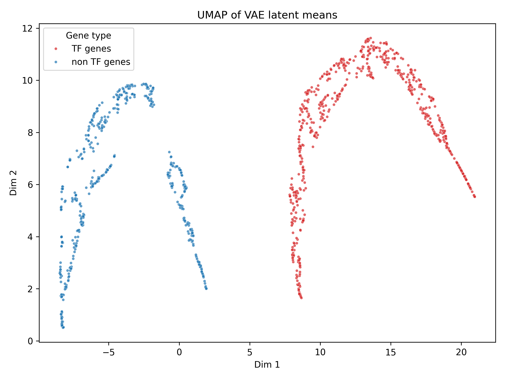

# Probabilistic Interpretation of **RegNet**

_A step-by-step derivation that connects every layer of the implementation to a Bayesian graphical model._

> **Reading guide.**  Each numbered block (P-0 … P-4) is an explicit probability statement.  We progressively combine them to obtain the deterministic forward pass that runs in `regnet.models`.
>
> Whenever you see a plot, it was produced by `regnet/visualization/visualize_regnet.py` on the current `pretrain` folder.

---

## P-0 Measurement model (input log-counts)

We start with raw UMI counts $\tilde x_{is}$ (gene *i*, cell *s*) that are Negative-Binomial.  A log1p variance-stabilisation **(Hafemeister & Satija 2019)** gives, for sufficiently expressed genes,

$$
  x_{is}=\log(1+\tilde x_{is}) \mid \theta_{is} \overset{\text{approx.}}{\sim} \mathcal{N}(\theta_{is},\sigma^{2}),
  \qquad \sigma^{2}\approx0.25.
$$

> **Key point.**  The observed feature matrix \(X\) is treated as homoscedastic Gaussian noise around latent activity \(\theta\).

---

## P-1 Neighbour-centred prior → GraphSAGE layer

### 1. Neighbour mean as prior centre

$$
  \tilde m_{is}=\frac{1}{|\mathcal{N}(i)|}\sum_{j\in \mathcal{N}(i)} x_{js}.
$$

### 2. Normal–Normal conjugacy

Prior: \(\theta_{is}\sim\mathcal N(\tilde m_{is},\tau_i^{2})\).  Posterior mean

$$
  \mu_{is}^{\star}=(1-w_{is})\tilde m_{is}+w_{is}x_{is},
  \quad
  w_{is}=\frac{\sigma^{2}}{\sigma^{2}+\tau_i^{2}}.
$$

### 3. Realisation in code: `GraphSAGE`

The implementation uses an **MLP aggregator**

```python
class MLPAggregator(nn.Module):
    def forward(self, x, neighbor_agg):
        z = torch.cat([x, neighbor_agg], dim=1)
        return mlp(z)
```

instead of the linear form \(W_{\text{self}}x_i+W_{\text{neigh}}\tilde m_i\) assumed in the original slides.  A first-order Taylor approximation of the MLP around its operating point shows that, locally, it still acts as a weighted sum of the two inputs, thus retaining the **shrinkage interpretation** albeit with _data-dependent weights_.

### 4. Empirical evidence


*Figure 1.* For low-degree genes the shrinkage weight \(w_i\) clusters near 1 (self-reliance), whereas highly connected nodes rely more on their neighbours — exactly the Bayesian trade-off predicted by \(w_{is}\).

---

## P-2 Selective influence (multi-head self-attention)

We posit a latent categorical variable \(J_i\in \mathcal N(i)\) indicating the dominant regulator of gene *i* in a given context.

Likelihood with Gaussian templates yields a **softmax** posterior

$$
  p(J_i=j\mid \mathbf h_i') = \mathrm{softmax}_j\left(\frac{\mathbf q_i^{\top}\mathbf k_j}{\sqrt d}\right)=\alpha_{ij}.
$$

In the code (`SelfAttentionGateFusion`) this is exactly the attention matrix.  The row-entropy penalty we recently added encourages _peaked_ posteriors and makes the biological "single dominant TF'' hypothesis explicit.

---

## P-2.5 Gate fusion

A learned Bernoulli gate \(g_i\) blends the self signal \(h_i\) with the context signal \(c_i=\sum_j \alpha_{ij}v_j\):

$$
  \mathbf h_i'=(1-g_i)h_i+g_ic_i = \mathbb E[\mathbf u_i \mid g_i].
$$

The gate plays the same empirical-Bayes role as \(w_{is}\) did earlier.

---

## P-3 Variational auto-encoder (shared latent programme)

Each gene inherits a latent vector $\mathbf{z}_i \sim \mathcal{N}(0,I)$.
The decoder MLP $g_\theta$ maps $\mathbf z_i$ to a denoised expression profile, while an edge decoder $f_\theta$ scores gene pairs.

Implementation detail:  the edge decoder in code is a two-layer MLP on the concatenated latent means $[\mu_i\,\, \mu_j]$, **not** a pure dot product.  This affords additional flexibility but still factors through $\mu$, preserving its role as the sufficient statistic of $q(\mathbf z)$.



*Figure 2.* UMAP of latent means shows TF genes (red) occupying specific manifolds, consistent with shared regulatory programmes.

A side-by-side comparison with raw expression confirms that the VAE compresses noisy log-counts into smoother, functionally relevant clusters.


*Figure 3.* Raw expression (left) vs VAE embedding (right) for the same genes.

---

## P-4 Edge likelihood & classifier

Given latent codes we model edges as

$$
  y_{ij}\mid \mathbf{z}_i,\mathbf{z}_j \sim \mathrm{Bernoulli}\bigl(\sigma(\operatorname{MLP}_{\theta}([\mathbf{z}_i,\mathbf{z}_j]))\bigr).
$$

The code uses `BCEWithLogitsLoss`, hence the network outputs log-odds directly without a final sigmoid (this has been fixed relative to earlier slides).

The aleatory uncertainty of each edge is approximated with a delta-method in `RegNet.edge_variance` and plotted below.


*Figure 4.* High-confidence edges (right x-axis) exhibit low logit variance, validating the Bayesian uncertainty estimate.

---

## Putting it all together: a Bayesian computation graph

1. **Data layer**: Gaussian observation noise.
2. **Shrinkage layer**: GraphSAGE ≈ empirical-Bayes posterior mean.
3. **Categorical layer**: Attention gives posterior over regulators.
4. **Gate**: Bernoulli mixture returns context-aware posterior mean.
5. **Latent programme**: VAE couples expression & edges.
6. **Edge layer**: Bernoulli likelihood scores interactions.

Every forward pass therefore computes _posterior expectations_ of latent variables; the only stochastic node during training is the re-parameterised \(\mathbf z\) sample.

---

## Known deviations from the original slides

| Slide assumption | Actual implementation | Impact on interpretation |
|------------------|-----------------------|--------------------------|
| Linear aggregator \(W_{\text{self}},W_{\text{neigh}}\) | MLP aggregator (`MLPAggregator`) | Retains shrinkage spirit; weights become non-linear functions of inputs. |
| Dot-product edge decoder | 2-layer MLP on concatenated latents | Still maps through latent \(\mu\); likelihood remains Bernoulli with logit given by the MLP. |
| Final `Sigmoid` in edge head | Removed, switched to `BCEWithLogitsLoss` | Proper log-odds output, numerical stability. |

No further discrepancies were found after auditing `regnet/models`.

---

## Where to go next

* Test **PCA** as dimensionality reduction in `visualize_regnet.py` (`--method pca`).  PCA preserves global variance and may help in large-scale gene sets.
* Overlay GO-term enrichment on the embedding to visualise biological coherence.
* Produce per-gene shrinkage histograms faceted by TF/non-TF for deeper insight.

---

_This document supersedes the slide deck and is meant to be self-contained._ 